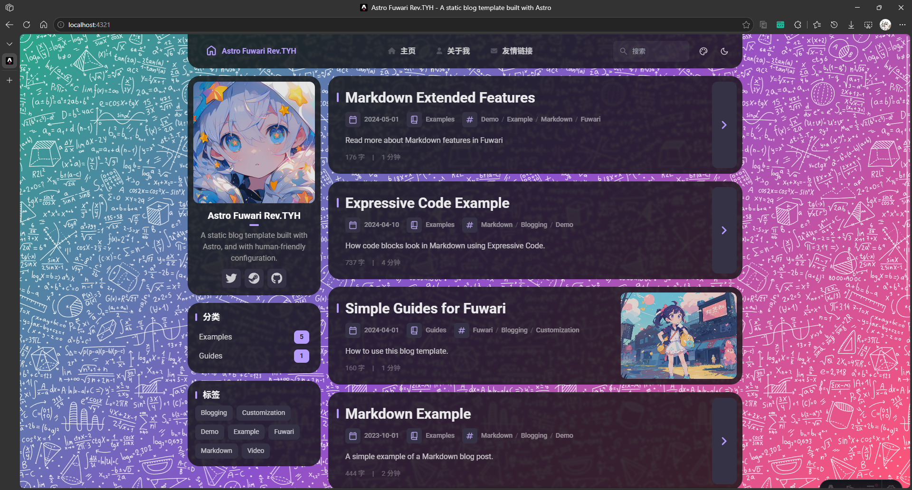

## ✨ 和原来 Fuwari 模板的区别
- 将配置格式迁移到了 `yaml` 格式 (位于 src/config.yaml )
- 增加了自定义背景, 可自由选择图片/纯色/渐变色背景, 图片支持 svg 格式, 并且 svg 格式的图片支持自定义颜色
- 将美化配置添加到了配置中

## 配置文件内容
```yaml
# 站点配置
siteConfig:
  author: Your Name
  avatar: assets/images/demo-avatar.png
  title: Astro Fuwari Rev.TYH
  subtitle: A static blog template built with Astro
  description: A static blog template built with Astro, and with human-friendly configuration.
  locale: zh_CN # 站点语言
  siteUrl: https://example.com  # 此站点地址在文章底部版权内容中用到
  
  # 文章底部的许可证信息
  page-width: 75rem
  license:
    enable: true
    name: CC-BY-NC-SA 4.0
    url: https://creativecommons.org/licenses/by-nc-sa/4.0/
  
  favicons: []
    # - src: '/favicon/icon.png'
    #   theme: 'light'
    #   sizes: '32x32'
  keywords:
    - your key words
    - more
    - more annnnd more
  
  toc:
    enable: true
    depth: 2

  # 文章链接格式配置，支持以下占位符：
  # :slug ------->  文章的 slug，slug 是根据文章标题自动生成的 URL 友好字符串, 中文会被转换为拼音
  # :year ------->  文章发表时间的年份,
  # :month ------>  文章发表时间的月份, 个位时补 0
  # :day -------->  文章发表时间的日期, 个位时补 0
  # :hour ------->  文章发表时间的小时, 个位时补 0
  # :min -------->  文章发表时间的分钟, 个位时补 0
  # :sec -------->  文章发表时间的秒数, 个位时补 0
  # :category --->  文章的第一个分类, 如果没有分类则使用 'uncategorized'
  # :timestamp -->  文章发表时间的时间戳
  # :crc32 ------>  由文章标题和内容计算的 CRC32 校验值 
  #                 注意: 由于 CRC32 校验值是根据文章标题和内容计算的, 因此在文章标题或内容发生变化时 CRC32 校验值也会随之改变, 
  #                 这可能会导致文章链接发生变化, 因此不建议使用 :crc32 占位符, 除非你有特殊需求并且能够接受文章链接可能发生变化的情况
  # :id --------->  文章的唯一 ID, 长度为 8 位 hex 值, 通过创建文章命令生成新文章时自动分配, (手动创建的文章将会在第一次加载时自动分配, )
  #                 分配时以创建时间 (精确到毫秒的时间戳) 和文章标题的 CRC32 校验值为基础生成一个唯一的 ID, 并且此后不会再改变
  # :id_dec ----->  文章的唯一 ID 的十进制表示, 长度为 10 位数字, 当 id 的十进制表示位数不足 10 位时自动补 0
  postPermalink: /posts/:id_dec  # 文章链接格式，:id 会被替换为文章的唯一 ID
  # 本模板内供的一些页面可以在下面开启或关闭使用
  pages:
    categories:
      enable: true
      link: /categories
    tags:
      enable: true
      link: /tags
    about:
      enable: true
      link: /about
    friends:
      enable: true
      link: /friends
    timeline:
      enable: true
      link: /timeline
    archive:
      enable: true
      link: /archive
    rss:
      enable: true
      link: /rss.xml
    atom:
      enable: true
      link: /atom.xml

#######################################
# 社交媒体链接，显示在页面左侧的个人信息中
#######################################
social-links:
  - name: twitter
    icon: fa6-brands:twitter
    url: "https://twitter.com"
  - name: steam
    icon: fa6-brands:steam
    url: "https://store.steampowered.com"
  - name: Github
    icon: fa6-brands:github
    url: "https://github.com"


#######################################
# 开发者配置
#######################################
dev:
  debug: false  # 调试选项

#######################################
# 站点顶部导航栏配置
#######################################
nav:
  title: 'Little Sweet'       # 导航栏标题
  title_icon: 'fa6-solid:bookmark'
  items:
    - link: '/'               # 导航链接地址
      text: 主页              # 导航显示文本
      icon: fa6-solid:house   # (可选) 图标，关于图标请参考 https://icones.js.org/collection/fa6-solid
      openInExternal: false   # (可选) 是否在新标签页打开链接, 默认为 false
    - link: '/about'
      text: 关于我
      icon: fa6-solid:user
    - link: '/friends'
      text: 友情链接
      icon: fa6-solid:envelope

#######################################
# 顶部 banner 图片
#######################################
banner:
  enable: false
  src: 'assets/images/demo-banner.png'
  position: 'center'  # 相当于 object-positon, 可选择的项有 top,center,bottom
  credit:
    enable: true     # 在 banner 左下角展示图片的版权信息
    text: ''          # 版权信息的文本内容
    url: ''           # (可选) banner 图片的源地址链接
  
  # banner 大小的一些设置
  banner-height: 65vh
  banner-height-extend: 30vh
  banner-overlap: 3.5rem

#######################################
# 站点美化配置
#######################################
beauty:
  theme: 'light'      # 主题，支持 'light','dark' 和 'auto' 三种选项，auto 会根据用户系统设置自动切换主题
  hue: 250            # 主题色调, 范围 0-360 
  hue-fixed: false     # 是否显示主题色调的调色盘，设置为 false 显示
  blur: 
    enable: true      # 是否启用背景模糊效果, 启用后会在背景上添加一个半透明的模糊层, 以增强前景内容的可读性
    intensity: 2      # 模糊半径, 输入整数值, 数值越大模糊效果越明显, 推荐值为 1-5 之间
  bgColorAlpha: 0.8   # 卡片背景、顶部导航栏颜色透明度

  border-radius: 25px  # 全局圆角半径

  # 主题色设置, 可以使用任何支持的颜色格式 如 rgb,rgba,hsl 等
  themeColors:
    # 日间模式主题色
    light:
      color-primary: '#2ACAA0'  # 主题色
      card-bg: '#FFFFFF'        # 卡片的背景色，同时也是顶部导航栏的背景色
      text-primary: '#121212'   # 文本的主色调

    # 夜间模式主题色
    dark:
      color-primary: '#2ACAA0'  # 主题色
      card-bg: '#121212'

  # body 背景设置, 若同时启用背景图和背景色, 则背景图的显示优先级要高于背景色
  background:

    # 背景图片设置
    image:
      enable: true    # 是否启用背景 
      url: 'assets/images/blog_bg/bg8.svg'    # 背景图片地址, 若图片位于 public 文件夹下, 路径应当以 '/' 开头, 若图片位于 src 文件夹下, 则注意将图片放在 src/assets 文件夹内
      svgColor: '#FFFFFF'                     # 当背景图为纯色的 SVG 图片时, 可以设置此项来自定义 svg 颜色

    # 背景色设置
    color:
      enable: true  # 启用背景色
      linear: true  # 是否启用渐变色背景, 如果为 false 则使用颜色列表中的第一个颜色, 为 true 则需要至少提供 2 种颜色, 至多 3 种。
      deg: 135       # 渐变旋色转角度, 输入整数值 0-360
      colors:       # 颜色列表, 最多可以有三个
        - '#2AA789'
        - '#8c51cd'
        - '#FF5577'

```

## 魔改后的样图


```text
注意：配置文件中未实现全部的功能, 后续会慢慢加上去的, 下面仅列出 key 值

siteConfig.keywords
siteConfig.postPermalink
siteConfig.pages
beauty.themeColors
```
